# Slate — an AI workspace for understanding, exploring, and working with information.

Slate is a pure **LangChain & LangGraph** multi-agent retrieval and reasoning engine designed to parse, index, search, and reason across complex multimodal documents (PDFs, Markdown, Tables, Scanned Docs) with end-to-end provenance citations.

---

## Key Highlights

- **Pure LangGraph Orchestration**: Zero ad-hoc routing scripts; both ingestion and query are modeled as formal typed state machines (`IngestionGraph` & `QueryGraph`).
- **CRAG (Corrective RAG)**: Self-grading relevance check that triggers semantic query reformulation if document retrieval quality drops below threshold.
- **Multimodal Document Processing**: High-fidelity layout parsing via **Docling**, automatic fallback to **PaddleOCR** for scanned PDFs, separate structured stores for tables (`TableStore`) and image captions (`ImageStore`).
- **Cross-Encoder Reranking**: Direct integration of `BAAI/bge-reranker-v2-m3` on top of dense semantic embeddings (`BAAI/bge-m3`).
- **Precision Inline Citations**: Automatic bracket-style source attribution (`[filename.pdf, p.X]`) linked to verified document coordinates.
- **Quantitative RAGAS Benchmarking**: Built-in evaluation harness measuring **Faithfulness**, **Answer Relevancy**, **Context Precision**, and **Context Recall**.
- **Full Observability**: Integrated LangSmith tracing for every step of state transition.

---

## Architecture Overview

```mermaid
flowchart TD
    subgraph Ingestion Pipeline [IngestionGraph]
        Doc[Document Upload] --> Val[Validate File]
        Val --> Reg[Register Document]
        Reg --> Parse[Parse with Docling]
        Parse --> OCRCheck{OCR Needed?}
        OCRCheck -- Yes --> Paddle[PaddleOCR Fallback]
        OCRCheck -- No --> Chunk[Chunk & Classify]
        Paddle --> Chunk
        Chunk --> MultiStore[Index: ChromaDB + TableStore + ImageStore]
    end

    subgraph Query Pipeline [QueryGraph: 18 Nodes]
        Q[User Query] --> LoadP[Load Project & History]
        LoadP --> Mentions[Resolve @Document Mentions]
        Mentions --> Understand[Query Understanding & Modality]
        Understand --> Complex{Determine Complexity}
        Complex -- Complex --> Decomp[Decompose Query Subgraph]
        Complex -- Simple --> Route[Route Retrieval]
        Decomp --> Route
        Route --> Ret[Hierarchical Multi-Store Retrieval]
        Ret --> Rerank[BGE Cross-Encoder Rerank]
        Rerank --> CRAGCheck{CRAG Quality Grade}
        CRAGCheck -- Low Quality --> Reform[Query Correction Subgraph]
        Reform --> Ret
        CRAGCheck -- High Quality --> ContextAssm[Context Assembly]
        ContextAssm --> MMReason[Multimodal Reasoning Subgraph]
        MMReason --> Gen[SlateChatModel Generation]
        Gen --> Verify[LLM Grader Verification]
        Verify --> Cite[Citation Builder]
        Cite --> Ans[Final Response + Citations]
    end
```



---

## Evaluation Benchmark

---

## Quickstart

### 1. Installation
Ensure Python 3.13+ is installed:
```bash
git clone <repo_url>
cd Slate
uv sync
```

### 2. Configure Environment
Copy `.env.example` to `.env` and set your API keys:
```bash
cp .env.example .env
```
Supported providers: Groq, Gemini, OpenAI, or offline local synthesis.

### 3. Run Backend API
```bash
uv run uvicorn src.api.main:app --reload --port 8000
```

### 4. Run Evaluation CLI
```bash
uv run python evaluate.py --dataset data/evaluation_dataset.json
```

### 5. Run Test Suite
```bash
uv run pytest
```
